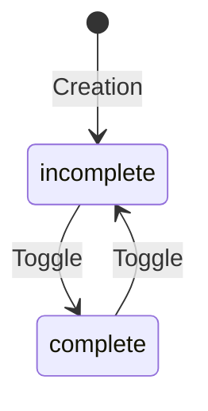

# Data Model: Mark Todo Task Complete/Incomplete

## Entities

### Task (Modified State)

| Field | Type | Description |
|-------|------|-------------|
| status | str | "complete" or "incomplete" |

## State Transitions

## Validation Rules

1. **Existence**: The ID must exist in `TaskStorage`.
2. **ID Type**: Must be a positive integer.
